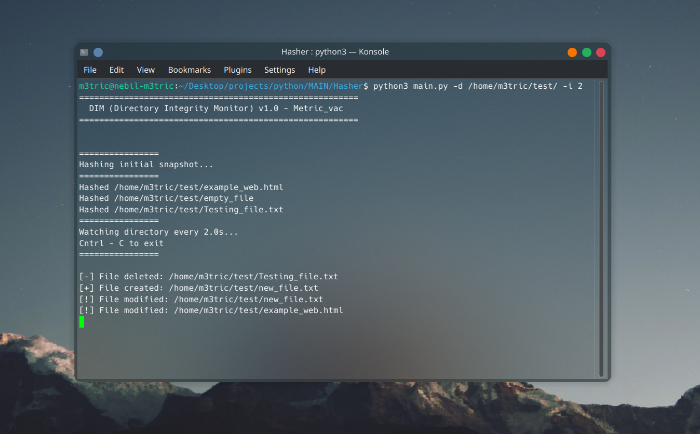

# DIM (Directory Integrity Monitor)
## A CLI tool that monitors directories for any changes

---

## Information

### DIM is a python CLI tool that monitors directories in real-time and looks for changes/modifications. It does that by hashing all files in folders and sub-folders using SHA-256 when run and compares each file's current hash to the originial hash. It also is optimized by checking files metadata and hashes the ones that have been changed since the first hash. It is also has customizable interval time(How many seconds until the next scan)

---

## Why This Tool Exists
### Important files can be modified, replaced and deleted without the user knowing. This tool combats that with its extremely fast detection speed and accuracy when verifiyng file integrity

---

## Features
 * Detects new files
 * Detects file modifications using SHA256 hashing
 * Detects deleted files
 * Configure scan interval
 * Recursive directory scanning
 * Lightweight and dependency-free

---
## Example


---

## AI Usage
### I used AI in this project for assistance on how to use argparse. I was unfamiliar with the external package and i have never made a CLI tool with flags like this before. With the help of YouTube tutorials and AI, I was able to make use argparse and make a good CLI tool

---

## How To Use

### First make sure all the packages have been installed by running this command
```bash
pip install -r requirements.txt
```

## DIM uses flags to choose directories and scan interval time

## Choosing A directory
### To choose a directory you use **-d** or **--dir**

```bash
python main.py -d /path/to/directory
```

## Choosing An Interval Time
### To choose an interval Time, you use **-i** or **--interval**
```bash
python main.py -d /path/to/directory -i 3
```

----

### Thats about it for this project, I really enjoyed making this project. I learnt some new things that'll definetly help me in the future. Im also thankful for OwlSec for organizing the competition:).


